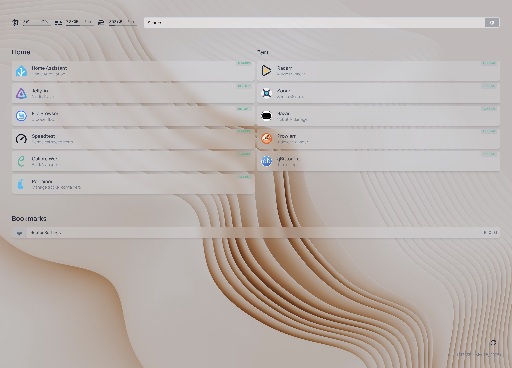

# Home

**This is the docker-compose based setup for running different services on my "home server" (old laptop).**

I use [homepage](https://gethomepage.dev/) as an application dashboard:

The main service I use is Home Assistant, for controling smart lights etc.

## Notes for myself:

Set up [govee2mqtt](https://github.com/wez/govee2mqtt/blob/main/docs/DOCKER.md) in Home Assistant.
Remember that the MQTT broker is running under server.local, not localhost, since the container is not running in the host network.

Docker Desktop is the enemy, and you'll probably need Docker CE to map /dev devices into the container.

To use the docker registry from a client, you'll need to add the registry to your docker client (where you want to push/pull etc from), since the registry is currently not running over TLS.
